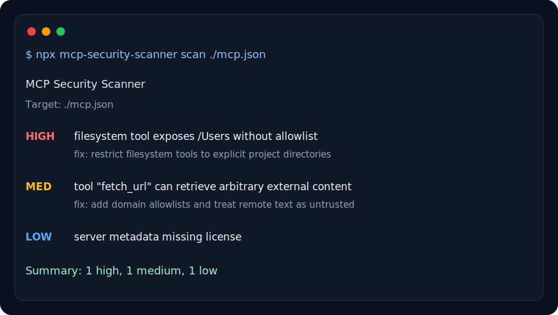

# MCP Security Scanner

The npm-audit for MCP servers.

Before installing an MCP server, run one command and see what it can actually do.

Scan MCP servers for dangerous tools, prompt-injection risks, excessive permissions, and unsafe agent capabilities before you connect them to Claude, Codex, Cursor, or other AI agents.



## Quick Start

```bash
npx mcp-security-scanner scan ./mcp-server-config.json
```

Add it to CI:

```yaml
- uses: lorbeere711/mcp-security-scanner@v0
  with:
    target: ./mcp.json
    format: sarif
    fail-on: high
```

## Positioning

`mcp-security-scanner` focuses on fast, explainable, install-time risk checks for MCP servers.

This project is intentionally different from runtime sandboxing and broad research efforts:

- It is a lightweight CLI you can run in CI and pre-install workflows.
- It reports concrete, explainable findings with actionable remediation text.
- It produces machine-readable output (`json`, `sarif`) for security tooling.

## What It Scans (MVP 0.1)

- Dangerous permissions (`PERM-001`)
- Broad filesystem permissions without allowlists (`FS-001`, `FS-002`)
- Prompt injection indicators (`PROMPT-001`, `PROMPT-002`)
- Unsafe tool descriptions (`TOOLS-001`, `TOOLS-002`)
- Potential data exfiltration paths (`EXFIL-001`)
- Missing metadata signals (`META-001`)
- Broad network permissions without host allowlists (`PERM-003`)
- Risk score (`0-100`) with severity-oriented report output

## Detectors

| ID | Severity | Description |
| --- | --- | --- |
| `PERM-001` | high | Dangerous permission detected (shell, exec, sudo, etc.) |
| `PERM-002` | high | Broad filesystem permission without path allowlist |
| `PERM-003` | medium | Broad network permission without host allowlist |
| `FS-001` | high | Broad filesystem permission (filesystem:all / filesystem:write) without path allowlist |
| `FS-002` | medium | Filesystem read access without path allowlist |
| `PROMPT-001` | critical | Prompt injection indicator found |
| `PROMPT-002` | high | Untrusted content flow into prompts |
| `TOOLS-001` | medium | Unsafe tool description |
| `TOOLS-002` | low | Tool description suggests external data access |
| `EXFIL-001` | critical | Potential sensitive data exfiltration path |
| `META-001` | low | Missing server metadata (name / license) |

## Why

MCP adoption is growing quickly, while security checks are often ad hoc. This scanner provides a practical baseline for CI pipelines and local hardening reviews.

## Install

Use with npx:

```bash
npx mcp-security-scanner scan ./mcp-server-config.json
```

Or install locally for development:

```bash
npm install
npm run build
```

## Usage

```bash
mcp-security-scanner scan ./mcp-server-config.json
mcp-security-scanner scan ./mcp-server-config.yaml
mcp-security-scanner scan --server @modelcontextprotocol/server-filesystem
mcp-security-scanner audit ./mcp-server-config.json --format sarif
mcp-security-scanner scan ./mcp-server-config.json --format json
mcp-security-scanner scan ./mcp-server-config.json --format markdown
mcp-security-scanner scan ./mcp-server-config.json --format sarif --output report.sarif
mcp-security-scanner scan ./mcp-server-config.json --fail-on critical
mcp-security-scanner scan ./mcp-server-config.json --fail-on none
mcp-security-scanner scan ./mcp-server-config.json --ai-review
```

Formats:

- `text`: human-readable report (default)
- `json`: machine-readable full scan result (see [JSON Schema](#json-schema))
- `markdown`: paste-ready report for PR comments, issue notes, and audit summaries
- `sarif`: SARIF 2.1.0 report for code scanning tools

CI failure threshold:

- `--fail-on critical`: fail only on critical findings
- `--fail-on high`: fail on high or critical findings (default)
- `--fail-on medium`: fail on medium, high, or critical findings
- `--fail-on low`: fail on any finding
- `--fail-on none`: report-only mode, never fail because of findings

Experimental local AI review:

- `--ai-review`: run optional semantic review with a local model
- `--ai-provider ollama`: use Ollama at `http://localhost:11434`
- `--ai-model qwen3:1.7b`: default local model

AI review is local-first, opt-in, and never runs during default scans. The scanner does not bundle a model or require an API key; users run their own local Ollama model.

```bash
ollama serve
ollama pull qwen3:1.7b
mcp-security-scanner scan ./mcp-server-config.json --ai-review
```

For slower machines or CI smoke tests, use `qwen3:0.6b`. See [docs/AI_REVIEW.md](docs/AI_REVIEW.md).

### JSON Schema

The JSON report includes a `schemaVersion` field so consumers can validate compatibility.

```json
{
  "schemaVersion": "1.0.0",
  "target": "examples/insecure.json",
  "scannedAt": "2026-06-13T00:00:00.000Z",
  "findings": [
    {
      "id": "PERM-001",
      "severity": "high",
      "title": "Dangerous permission detected",
      "description": "Permission shell can enable high-impact actions.",
      "recommendation": "Apply least-privilege.",
      "path": "permissions"
    }
  ]
}
```

**Fields:**

| Field | Type | Description |
| --- | --- | --- |
| `schemaVersion` | `string` | Semantic version of the report schema (e.g. `"1.0.0"`) |
| `target` | `string` | Path or package name of the scanned MCP config |
| `scannedAt` | `string` | ISO 8601 timestamp of the scan |
| `findings` | `Finding[]` | Array of detected security findings |

Each `Finding` object:

| Field | Type | Description |
| --- | --- | --- |
| `id` | `string` | Unique finding identifier (e.g. `PERM-001`) |
| `severity` | `"low" \| "medium" \| "high" \| "critical"` | Risk level |
| `title` | `string` | Short description of the finding |
| `description` | `string` | Detailed explanation |
| `recommendation` | `string` | Actionable remediation text |
| `path` | `string \| undefined` | Optional JSON path to the risky config key |
| `source` | `"deterministic" \| "ai" \| undefined` | Finding source, present for AI findings |
| `confidence` | `"low" \| "medium" \| "high" \| undefined` | Confidence level for AI findings |
| `evidence` | `string[] \| undefined` | Evidence snippets for AI findings |

Example output:

```text
HIGH  filesystem tool exposes /Users without allowlist
MED   tool "fetch_url" can retrieve arbitrary external content
LOW   missing server metadata / license
```

Exit codes:

- `0`: no findings at or above the configured `--fail-on` threshold
- `1`: scanner/runtime error
- `2`: findings detected at or above the configured `--fail-on` threshold

## Development

```bash
npm run dev -- scan ./examples/insecure.json
npm run lint
npm run test
npm run build
npm run pack:check
```

## Adversarial Fixture Benchmarks

This repository includes adversarial benchmark fixtures under [examples/fixtures/](examples/fixtures/) to make deterministic scanner behavior explicit.

- Safe fixtures live in [examples/fixtures/safe/](examples/fixtures/safe/)
- Unsafe fixtures live in [examples/fixtures/unsafe/](examples/fixtures/unsafe/)
- Expected outcomes are tracked in [examples/fixtures/manifest.json](examples/fixtures/manifest.json)

Each manifest entry includes:

- `expectedFindingIds`: findings that must be present for the fixture
- `mustMissFindingIds`: findings intentionally expected to be absent (known false negatives)
- `notes`: rationale for why the fixture exists

Run fixture benchmarks with:

```bash
npm run test
```

### Known Limitation: Natural-Language Exfiltration Intent

The scanner is deterministic and keyword-driven in several rules. This means natural-language descriptions can imply risky behavior without matching current keyword patterns.

Example: a tool description that says it will "share diagnostics with a configured service endpoint" may represent exfiltration intent but may not currently trigger `EXFIL-001`.

This limitation is tracked explicitly in the adversarial fixture suite as a known false negative, so misses are visible and regression-tested instead of hidden.

### Adding New Benchmark Fixtures

1. Add the fixture JSON file to the appropriate folder under [examples/fixtures/](examples/fixtures/).
2. Add or update the corresponding entry in [examples/fixtures/manifest.json](examples/fixtures/manifest.json).
3. Keep fixture metadata focused on finding IDs (`expectedFindingIds` and `mustMissFindingIds`) to avoid brittle tests.
4. Run `npm run test` and confirm behavior is explicit for both expected detections and known misses.

## GitHub Action

Full pull request workflow:

```yaml
name: MCP Security Scan

on:
  pull_request:
  push:
    branches: [main]

permissions:
  contents: read
  pull-requests: write

jobs:
  mcp-security:
    runs-on: ubuntu-latest
    steps:
      - uses: actions/checkout@v4
      - uses: lorbeere711/mcp-security-scanner@v0
        with:
          target: ./mcp.json
          format: sarif
          fail-on: high
          comment-pr: true
```

```yaml
- uses: lorbeere711/mcp-security-scanner@v0
  with:
    target: ./mcp.json
    format: sarif
    fail-on: high
```

Or scan a server package:

```yaml
- uses: lorbeere711/mcp-security-scanner@v0
  with:
    server: @modelcontextprotocol/server-filesystem
    format: sarif
    fail-on: critical
```

Post or update a PR summary comment:

```yaml
permissions:
  contents: read
  pull-requests: write

steps:
  - uses: actions/checkout@v4
  - uses: lorbeere711/mcp-security-scanner@v0
    with:
      target: ./mcp.json
      format: sarif
      fail-on: high
      comment-pr: true
```

Upload SARIF to GitHub code scanning:

```yaml
permissions:
  contents: read
  security-events: write
  pull-requests: write

steps:
  - uses: actions/checkout@v4
  - uses: lorbeere711/mcp-security-scanner@v0
    with:
      target: ./mcp.json
      format: sarif
      output: mcp-security.sarif
      fail-on: high
      comment-pr: true
  - uses: github/codeql-action/upload-sarif@v3
    if: always()
    with:
      sarif_file: mcp-security.sarif
```

## Publish Preparation

```bash
npm run prepublishOnly
npm run pack:check
```

If checks pass, publish from a trusted environment with npm credentials configured.

## Contribution Ideas

- good first issue: add JSON output enhancements and stable schema docs
- help wanted: improve SARIF mapping for GitHub code scanning UX
- help wanted: add MCP server registry scanner support
- research: map known MCP vulnerabilities to detector rules
- published 20-server report: [docs/SECURITY_PATTERNS_REPORT.md](docs/SECURITY_PATTERNS_REPORT.md)

See [docs/ROADMAP.md](docs/ROADMAP.md) for planned work and evaluation ideas.

## Roadmap

- Rule config and suppressions
- CI integration helpers
- Expanded MCP schema awareness

## License

MIT
